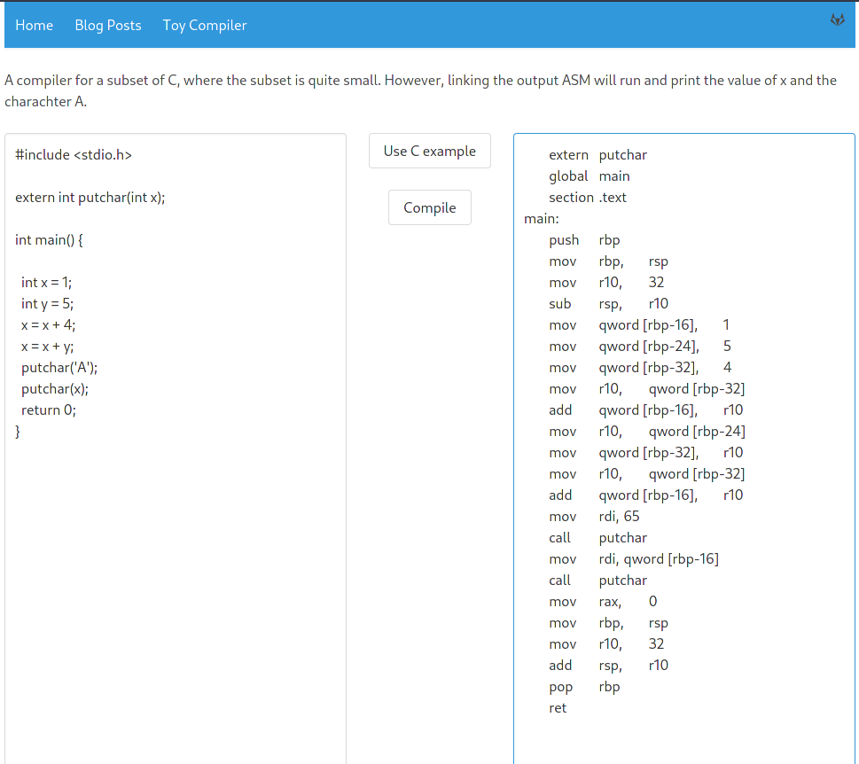

# My Site

[https://me.jarhb.com](https://me.jarhb.com)

Very appropriate name yes.

## Building
The docker builds are optimized for being ran on a raspberry pie and
as such the container image here is for arm64 which may therefore not run on a amd64 system.

## Why?
Why build yet another about me site when there are a significant amount of "me blog me here yes" sites as is?
Well, how many of those send a SPA with a [c-subset compiler](https://gitlab.com/arxra/my-cigrid-compiler) within? Not many!
Is that really necessary though? Absolutely not! But it was fun seeing how one project integrates into your next (even if one of them is obligatory uni work).

## Spoilers
Got the compiler working! 

